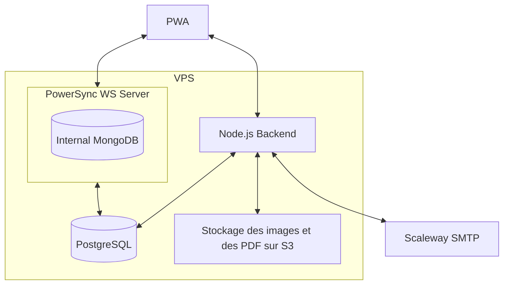
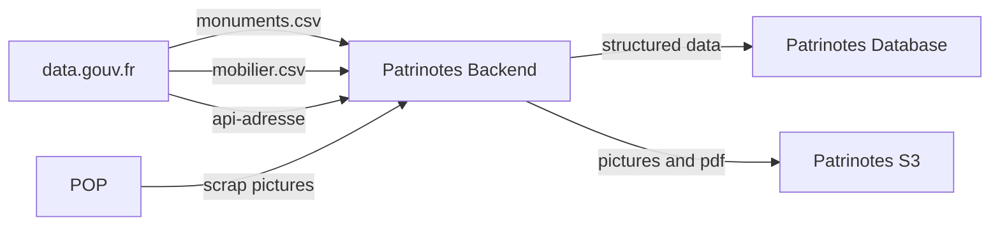

# Installation

### Prérequis:

- node >= 20
- pnpm = 8.4.0

### Utilisation

- `pnpm install`
- Copy `.env.dist` to `.env` and fill the variables
- `docker compose up -d`
- `pnpm migration:up`
- `pnpm backend dev`
- `pnpm frontend dev`

La whitelist n'est pas active dans l'environnement de développement

# Découverte du service, premiers pas

// TODO

# Infrastructure



# Données



# Framework et dépendances

## Architecture du repo

L'application est un monorepo pnpm séparé en 3 packages

- `backend` qui est une application NodeTS reponsable de l'authentification, du CRUD sur la base de données, ainsi que
  de la génération du pdf
- `frontend` qui est une PWA conçue avec Vite et ReactTS
- `pdf` qui contient la logique partagée entre les 2 précédents packages

## Base de données et synchronisation

L'application utilise une base de données Postgres, définie par la variable `DATABASE_URL` dans le fichier `.env`. Pour
effectuer des requêtes, le frontend et le backend utilisent `kysely`.

### Synchronisation

L'application utilise le service [PowerSync](https://docs.powersync.com/intro/powersync-overview) comme moteur de
synchronisation. Il est composé :

- d'un serveur WebSocket connecté à un replica de la base de données
- d'une base de données Mongo interne (qui n'a pas besoin d'être persistante)

Le workflow est le suivant :

- Les règles d'accès au données sont définies dans le fichier `powersync-config.yaml`
- Le frontend se connecte via WebSocket et reçoit les données auxquelles il a accès, ainsi que leurs modifications en
  temps réel, et les stocke dans une base de données IndexedDB
- L'utilisateur modifie ses données locales
- Le frontend envoie les données au backend via une requête POST, qui applique les modifications sur la base de données
- Le service PowerSync est notifié grâce au replica, et diffuse ces modifications à tous les utilisateurs concernés

### Migrations

Les migrations sont générées automatiquement grâce à la commande `pnpm migration:generate` après modification du fichier
[schema.ts](./packages/backend/src/db/schema.ts).

Lors du développement, il est possible d'utiliser `pnpm backend drizzle push` pour modifier la base de données locale
sans générer de migrations, puis de générer les migrations avant de commit.

> [!WARNING]  
> Si les migrations concernent des données accessibles en frontend, se référer à
> ([la documentation Powersync](https://docs.powersync.com/maintenance-ops/deploying-schema-changes)), et vérifier :
>
> - que les nouvelles tables font partie de la publication SQL `powersync`
> - que les nouvelles tables et ou données ont été ajoutées dans le
>   [schéma frontend](./packages/frontend/src/db/AppSchema.ts)

Pour exécuter les migrations : `pnpm migration:up`.

## API

Le routeur est défini avec `fastify` et les requêtes sont validées avec `typebox`.

Le RPC se génère grâce à la commande `pnpm client:generate`, qui

- génére le fichier `openapi.json` grâce à [`@fastify/swagger`](https://github.com/fastify/fastify-swagger)
- génére le fichier `api.ts` grâce à [`typed-openapi`](https://github.com/astahmer/typed-openapi)

# Scripts

- `clearDb.sh` clears local postgres db
- `frontend/createEnvFile.ts` used in prod to inject env vars starting with VITE\_ at runtime

```

```
